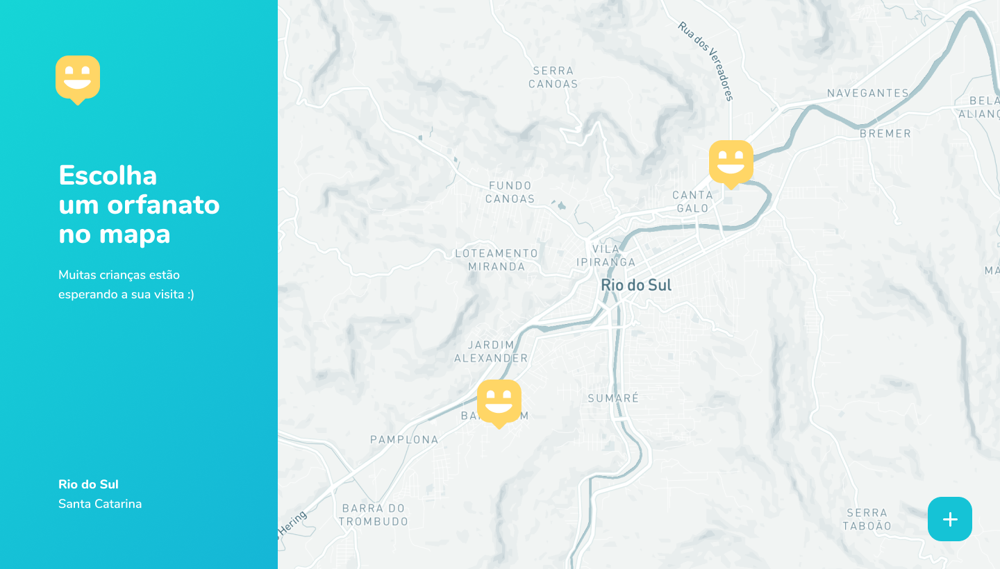
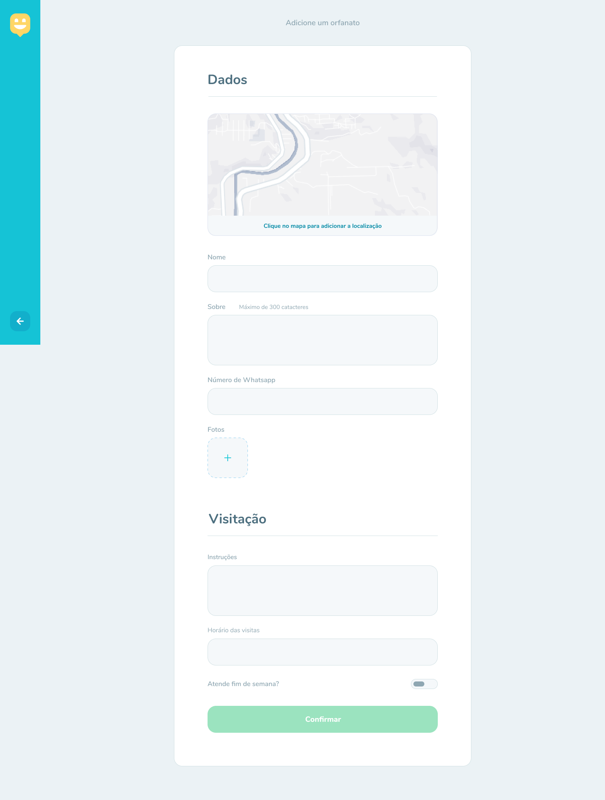
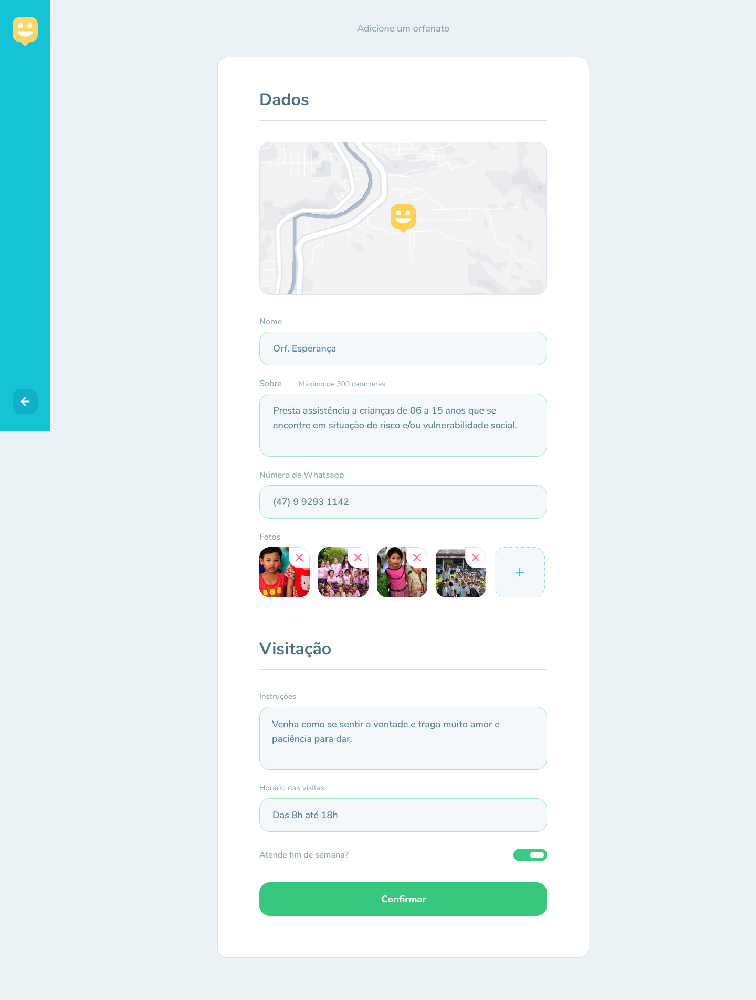
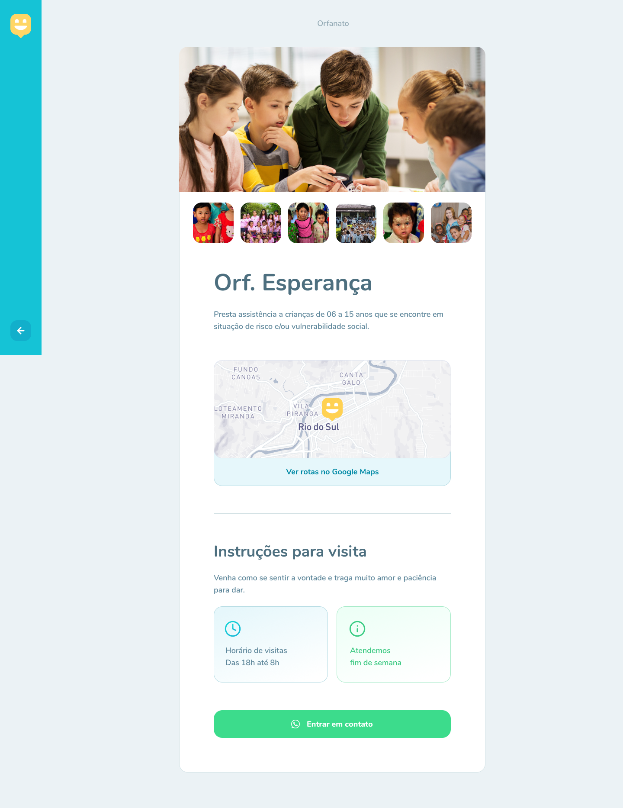

<h1 align="center">


Happy backend :rocket:

</h1>

<p align="center">
  Happy backend - Find orphanages
  <br>
  <br>

  <a href="www.linkedin.com/in/rhalfoliveira">
    
  </a>
  <a href="https://github.com/qwwerty/happy-api/commits/master">
    
  </a>

</p>

<p align="center">
  <a href="#dart-sobre">About</a> &#xa0; | &#xa0; 
  <a href="#rocket-tecnologias">Technologies</a> &#xa0; | &#xa0;
  <a href="#white_check_mark-requerimentos">Requirements</a> &#xa0; | &#xa0;
  <a href="#checkered_flag-começando">Starting</a> &#xa0; &#xa0; | &#xa0;
  <a href="#framed_picture-imagens">Images</a> &#xa0; &#xa0;
</p>

<br>

## :dart: About

Happy is an application that connects people to institutional care homes to make many children's days happier.

## :rocket: Technologies

The following technologies were used in the project:

- [Node 18](https://nodejs.org/en)
- [@fastify/busboy](https://www.npmjs.com/package/@fastify/busboy)
- [@fastify/cors](https://github.com/fastify/fastify-cors)
- [@img/sharp-linux-x64](https://www.npmjs.com/package/@img/sharp-linux-x64)
- [dotenv](https://duckduckgo.com/?q=dotenv&atb=v408-4wa&ia=web)
- [fastify](https://fastify.dev/)
- [fastify-multer](https://github.com/fox1t/fastify-multer)
- [sharp](https://duckduckgo.com/?q=sharp+js&atb=v408-4wa&ia=web)
- [eslint](https://eslint.org/)
- [prisma](https://www.prisma.io/)
- [@prisma/client](https://www.prisma.io/docs/orm/prisma-client)
- [tsx](https://duckduckgo.com/?q=tsx+js&atb=v408-4wa&ia=web)
- [vitest](https://vitest.dev/)
- [@aws-sdk/client-s3](https://docs.aws.amazon.com/AWSJavaScriptSDK/v3/latest/client/s3/)
- [Typescript](https://www.typescriptlang.org/)
- [Zod](https://zod.dev/)

## :white_check_mark: Requirements

- [Node](https://nodejs.org/en/)
- [Npm](https://www.npmjs.com/)
- [Yarn](https://yarnpkg.com/lang/en/)

## :checkered_flag: Starting

```bash
# Clone this project
$ git clone https://github.com/qwwerty/happy-api

# Access
$ cd happy-api

# Install dependencies
$ npm install

# Rename the .env.example file to .env and configure environment variables

# Run the container docker
$ docker compose up -d

# Run prisma migrates
$ npx prisma migrate dev

# Run the project
$ npm run dev

# The server will initialize in the <http://localhost:3000>
```

## :point_right: Figma

- [Figma](<https://www.figma.com/file/IvfKjdAkhV4jOKmnaOjW3D/Happy-Web-(Copy)?type=design&node-id=0%3A1&mode=dev>)

## :framed_picture: Images

<h1 align="center">
    
    
    
    
    
</h1>
